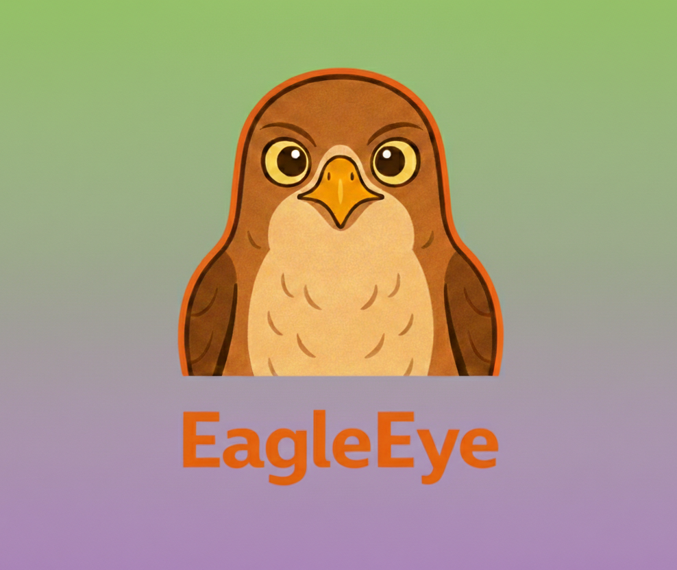
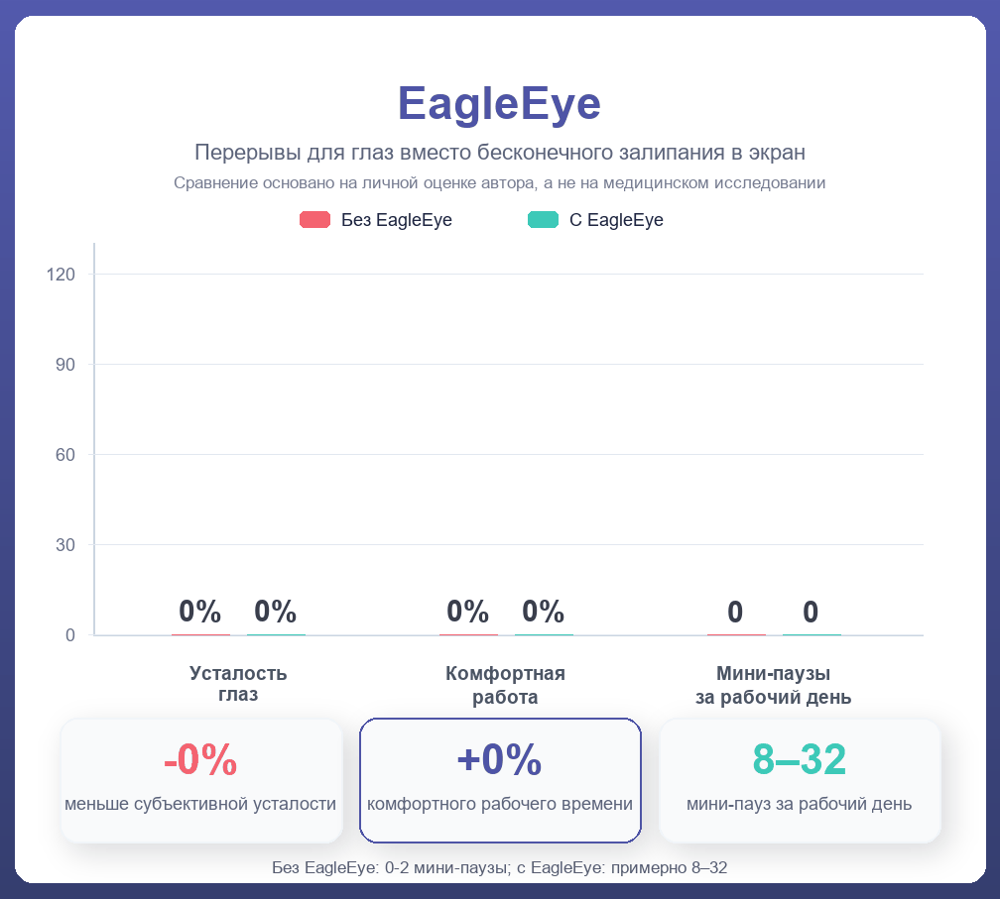
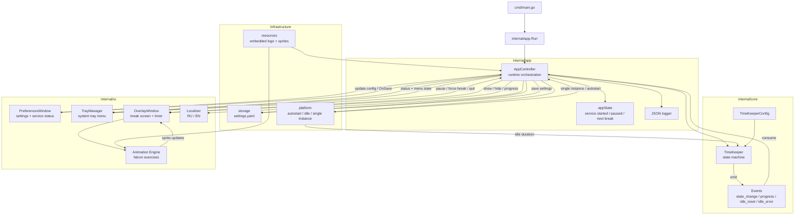
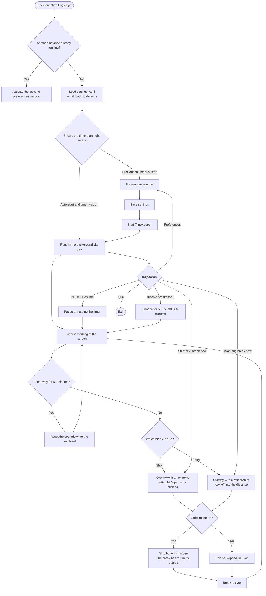

<p align="left"></p>

[](https://go.dev) [](https://fyne.io) []() [](https://github.com/DrNeuralDog/EagleEye/releases)

## The problem and the fix

Stare at a screen long enough and your eyes start begging for mercy: dryness, heaviness, blurry focus - and somehow the breaks you *swore* you'd take never actually happen. That itch is exactly what **EagleEye** was built to scratch - a small cross-platform utility that lives quietly in your system tray and nudges you back toward healthier eyes without getting in the way. Most of what's already out there feels dated or half-abandoned: clunky enterprise suites on one end, forgotten pet projects without proper cross-platform support, idle tracking, or a modern UI on the other.

The app reminds you to take short breaks, pops up an overlay with an animated falcon, and suggests simple exercises: look left and right, up and down, blink a few times, or focus on something in the distance. In the author's own experience, running this kind of rhythm lets you work **roughly 20% longer without eye strain** and makes mid-day micro-stretches something you actually do.

| Before EagleEye | After EagleEye |
| --- | --- |
| Hours of work with zero pauses | Breaks land on a predictable schedule |
| Eyes hurt, but "take a break" never registers | The overlay makes it crystal clear it's time to rest |
| Eye exercises stay in the "someday" pile | The falcon walks you through a specific exercise |
| No single place to manage breaks | Everything lives in the system tray |

### Before and after



> Heads up: EagleEye isn't a medical product and doesn't replace a doctor's advice. It's a practical utility for taking regular breaks and easing the everyday load that comes from long hours at a screen.

## Why EagleEye is worth having

- **Short breaks:** every 15 minutes for 15 seconds by default.
- **Long breaks:** every 50 minutes for 5 minutes by default.
- **Animated overlay:** the falcon shows you the exercise and a countdown of the time left.
- **Strict mode:** no quick skips - for when you want to actually stick with your breaks instead of snoozing them away.
- **Idle tracking:** a convenient bit of automation - no need to manually pause the timer every time you step away. Otherwise you get the classic annoyance: you sit back down at the computer and *boom*, instant break prompt. EagleEye notices on its own that you've been gone for 5+ minutes, counts that as rest, and restarts the countdown.
- **System tray:** status, pause, force the next break, force a long break, snooze reminders for a bit, and quit.
- **Auto-start:** Windows Registry Run Key, Linux autostart desktop entries, and macOS LaunchAgent are all supported.
- **Local settings:** a YAML file in your OS's standard user config directory.
- **RU / EN localization:** swap the language from the preferences window.

## How people actually use it

**A normal workday:** launch the app, hit Start, close the preferences window, and get back to work. EagleEye stays in the tray and shows how much time is left until the next break.

**A quick stretch:** when a short break hits, a compact or fullscreen overlay pops up with an eye exercise and a countdown.

**A longer rest:** after a longer stretch of work, the app suggests relaxing your gaze and looking off into the distance.

**Tray-level control:** pause the timer, snooze reminders for 5 / 15 / 30 / 60 minutes, trigger the next break immediately, or open preferences.

## Design principles

- **Set and forget:** the app should help in the background, not turn into one more source of noise.
- **Stays local:** no servers, no databases, no external accounts.
- **Testable core:** break scheduling is kept separate from the GUI.
- **Truly cross-platform:** platform-specific code is isolated in dedicated files with build tags.
- **Safe by default:** config and supporting files live in the user's config directory with restricted permissions (Windows: `%AppData%\EagleEye\settings.yaml`, Linux: `~/.config/EagleEye/settings.yaml` or `$XDG_CONFIG_HOME/EagleEye/settings.yaml`, macOS: `~/Library/Application Support/EagleEye/settings.yaml`).

## Under the hood

EagleEye is written in Go with Fyne. A clean state machine drives the break schedule, and the UI plus platform integrations sit in their own dedicated layers.

- **`cmd/main.go`** - a thin entry point that just calls `internal/app.Run`.
- **`internal/app`** - runtime orchestration: wires together settings, the timer, tray, overlay, animations, and platform services.
- **`internal/core/timekeeper`** - the state for work time, short/long breaks, pauses, and progress events.
- **`internal/ui/preferences`** - the Fyne preferences window.
- **`internal/ui/tray`** - the system tray manager and control commands.
- **`internal/ui/overlay`** - the break window with the timer, opacity, fullscreen mode, and topmost behavior.
- **`internal/ui/animation`** - the sprite-swapping logic for exercises.
- **`internal/storage`** - load and save `settings.yaml`.
- **`internal/platform`** - single-instance, autostart, and idle detection across OSes.
- **`resources`** - embedded logos and sprites via Go's `embed`.

## Application architecture



## User flow



## Install

The simplest path is to grab a prebuilt binary from the Releases page. No Go, no compilers, no dependencies to install.

**➡️ [Download the latest release from GitHub Releases](https://github.com/DrNeuralDog/EagleEye/releases/latest)**

| OS | File | What to do after downloading |
| --- | --- | --- |
| **Windows x64** | `EagleEye_windows_amd64.zip` | Extract it and run `EagleEye.exe`. On first launch Windows SmartScreen may throw a "Windows protected your PC" warning - click **More info → Run anyway** (the app isn't code-signed, which is normal for open source). |
| **Linux x64** | `EagleEye_linux_amd64.tar.gz` | `tar -xzf EagleEye_linux_amd64.tar.gz && ./eagleeye`. You'll need the OpenGL system libraries: `sudo apt install libgl1 libxxf86vm1` (Debian/Ubuntu). |
| **macOS Apple Silicon (M1/M2/M3)** | `EagleEye_darwin_arm64.tar.gz` | `tar -xzf EagleEye_darwin_arm64.tar.gz && ./EagleEye`. If Gatekeeper complains, right-click the binary → **Open** → confirm. Intel Macs can run this build transparently via Rosetta 2. |

The `checksums.txt` file in the same release contains a SHA-256 for each archive - verify integrity with `sha256sum -c checksums.txt` (Linux/macOS) or `Get-FileHash` (Windows PowerShell).

If you'd rather build from source by hand, see the **Build** section below.

## Build

### Requirements

- Go 1.21+
- Fyne v2.7+
- On Linux: Fyne/OpenGL system dependencies, for example `libgl1-mesa-dev` and `xorg-dev`
- For Windows builds with an embedded icon: PowerShell and `rsrc.exe` (the script can install it on first run with `-AllowGoNetwork`)

### Windows

```powershell
# Plain build
go mod tidy
go build -o bin/EagleEye.exe ./cmd

# Windows GUI exe with an embedded icon
powershell -ExecutionPolicy Bypass -File .\build_with_icon.ps1

# If rsrc.exe isn't installed yet
powershell -ExecutionPolicy Bypass -File .\build_with_icon.ps1 -AllowGoNetwork

# Run it
.\bin\EagleEye.exe
```

### Linux

```bash
# Example for Debian/Ubuntu
sudo apt install libgl1-mesa-dev xorg-dev

go mod tidy
go build -o bin/eagleeye ./cmd
./bin/eagleeye
```

### macOS

```bash
go mod tidy
go build -o bin/EagleEye ./cmd
./bin/EagleEye
```

### Cross-platform builds

```bash
# Windows
GOOS=windows GOARCH=amd64 go build -o bin/EagleEye.exe ./cmd

# Linux
GOOS=linux GOARCH=amd64 go build -o bin/eagleeye-linux ./cmd

# macOS
GOOS=darwin GOARCH=amd64 go build -o bin/eagleeye-macos ./cmd
```

### Release pipeline

The CI pipeline in `.github/workflows/release.yml` builds binaries for Windows, Linux, and macOS (Apple Silicon) on native GitHub runners, generates `checksums.txt`, and publishes them to GitHub Releases automatically whenever a git tag matching `v*` is pushed (for example, `v0.1.0`). For a quick local snapshot check you can use GoReleaser:

```bash
# Snapshot build for the current platform (no publishing)
goreleaser build --snapshot --clean --single-target
```

## Verification

```bash
# Full test suite
go test ./...

# Static analysis with the standard Go tool
go vet ./...

# Build check
go build ./cmd/...

# If golangci-lint is installed
golangci-lint run ./...
```

## Roadmap

EagleEye started out as a simple eye-care utility, but the bigger picture is to grow it into a convenient personal platform for digital health and productivity.

- **Mobile apps:** ports to Android and iOS, so eye-stretch and break reminders follow you beyond the desktop.
- **Digital health platform:** expanding from "break timer" to a proper digital-wellbeing tracker - posture, active screen time, and the balance between work and rest.
- **Eye-fatigue tests:** short built-in checks for vision and focus (contrast sensitivity, acuity, accommodation) so users can watch their own trends over time.
- **Cognitive-fatigue tests:** simple cognitive mini-tasks (reaction time, working memory, attention) that hint when it's time to wrap up for the day.
- **Behavior tracking:** how many stretches you actually completed today versus skipped, stats by day and week, long-term trends.
- **Social integrations:** share progress with friends and coworkers - less eye strain, more completed stretches, a steadier workday.
- **Data export:** dump local stats to CSV/JSON for people who want to analyze themselves by hand or plug into other health trackers.

## Get in touch 📫

Email: neural_dog@proton.me

---

*EagleEye built with Go and Fyne. Маленькая утилита, которая вовремя напоминает: глаза тоже часть рабочего процесса.*
