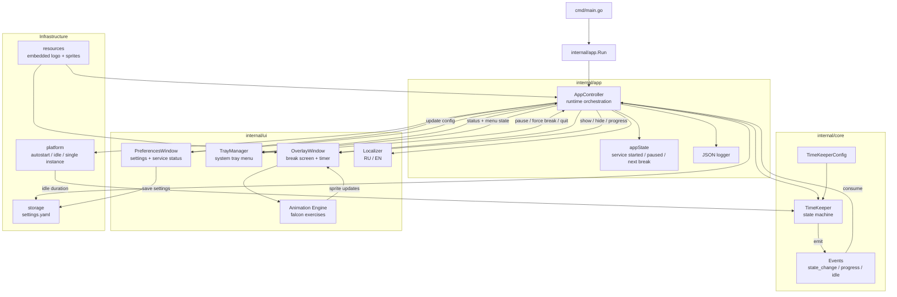
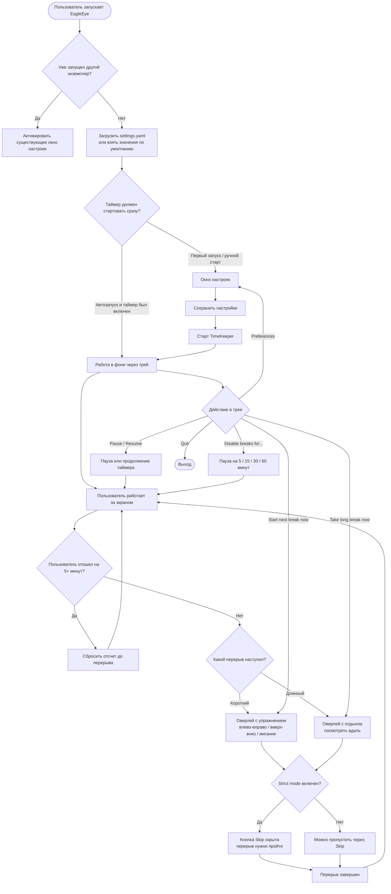

<p align="left"></p>

[](https://go.dev) [](https://fyne.io) []()

## Проблема и решение

Если постоянно залипать в экран на много часов подряд, глаза быстро начинают уставать: появляется сухость, тяжесть, расфокус, а нормальные перерывы легко забываются. Именно из этой боли и появился **EagleEye** - небольшая кроссплатформенная утилита, которая живет в системном трее и мягко возвращает внимание к здоровью глаз.

Приложение напоминает о коротких паузах, показывает оверлей с анимированным соколом и предлагает простые упражнения: посмотреть влево-вправо, вверх-вниз, поморгать или перевести взгляд вдаль. По личному опыту автора, такой режим помог работать примерно на **20% дольше без дискомфорта в глазах** и чаще делать мини-зарядку днем.

| До EagleEye | После EagleEye |
| --- | --- |
| Работа идет часами без пауз | Перерывы появляются по расписанию |
| Глаза устают, но отвлечься забываешь | Оверлей явно напоминает, что пора дать глазам отдых |
| Зарядка для глаз остается "на потом" | Сокол показывает конкретное упражнение |
| Нет единого управления перерывами | Все управляется из системного трея |

### Сравнение до и после


> Важно: EagleEye не является медицинским продуктом и не заменяет рекомендации врача. Это практичная утилита для регулярных пауз и снижения бытовой нагрузки от долгой работы за экраном.

## Почему EagleEye полезен

- **Короткие перерывы:** по умолчанию каждые 15 минут на 15 секунд.
- **Длинные перерывы:** по умолчанию каждые 50 минут на 5 минут.
- **Анимированный оверлей:** сокол показывает упражнение и таймер оставшегося отдыха.
- **Strict mode:** режим без быстрого пропуска, если нужно дисциплинированно соблюдать отдых.
- **Idle tracking:** если пользователь отошел от компьютера на 5+ минут, таймер считает это отдыхом и начинает отсчет заново.
- **Системный трей:** статус, пауза, принудительный следующий перерыв, длинный перерыв, временное отключение напоминаний и выход.
- **Автозапуск:** поддержка Windows Registry Run Key, Linux autostart desktop entry и macOS LaunchAgent.
- **Локальные настройки:** YAML-файл в стандартной пользовательской config-директории ОС.
- **RU/EN локализация:** язык можно переключить в окне настроек.

## Основные сценарии

**Обычный рабочий день:** запустил приложение, нажал Start, свернул настройки и работаешь дальше. EagleEye остается в трее и показывает, сколько осталось до следующего перерыва.

**Короткая разминка:** когда наступает короткий перерыв, появляется компактный или полноэкранный оверлей с упражнением для глаз и обратным отсчетом.

**Длинный отдых:** после более длинного рабочего отрезка приложение предлагает расслабить взгляд и посмотреть вдаль.

**Контроль из трея:** можно поставить таймер на паузу, отключить напоминания на 5/15/30/60 минут, начать следующий перерыв сразу или открыть настройки.

## Технические детали

EagleEye написан на Go и Fyne. Внутри используется чистая state machine для расписания перерывов, а UI и платформенные интеграции вынесены в отдельные слои.

- **`cmd/main.go`** - тонкая точка входа, которая вызывает `internal/app.Run`.
- **`internal/app`** - runtime orchestration: связывает настройки, таймер, tray, overlay, анимации и платформенные сервисы.
- **`internal/core/timekeeper`** - состояние рабочего времени, коротких/длинных перерывов, паузы и progress-событий.
- **`internal/ui/preferences`** - окно настроек Fyne.
- **`internal/ui/tray`** - системный tray-менеджер и команды управления.
- **`internal/ui/overlay`** - окно перерыва с таймером, прозрачностью, fullscreen-режимом и topmost-поведением.
- **`internal/ui/animation`** - логика смены sprites для упражнений.
- **`internal/storage`** - загрузка и сохранение `settings.yaml`.
- **`internal/platform`** - single instance, autostart и idle detection для разных ОС.
- **`resources`** - встроенные логотипы и sprites через Go `embed`.

## Сборка

### Требования

- Go 1.21+
- Fyne v2.7+
- Для Linux: системные зависимости Fyne/OpenGL, например `libgl1-mesa-dev` и `xorg-dev`
- Для Windows-сборки с иконкой: PowerShell и `rsrc.exe` (скрипт может установить его при запуске с `-AllowGoNetwork`)

### Windows

```powershell
# Обычная сборка
go mod tidy
go build -o bin/EagleEye.exe ./cmd

# Сборка Windows GUI exe с иконкой
powershell -ExecutionPolicy Bypass -File .\build_with_icon.ps1

# Если rsrc.exe еще не установлен
powershell -ExecutionPolicy Bypass -File .\build_with_icon.ps1 -AllowGoNetwork

# Запуск
.\bin\EagleEye.exe
```

### Linux

```bash
# Пример для Debian/Ubuntu
sudo apt install libgl1-mesa-dev xorg-dev

go mod tidy
go build -o bin/eagleeye ./cmd
./bin/eagleeye
```

### macOS

```bash
go mod tidy
go build -o bin/EagleEye ./cmd
./bin/EagleEye
```

### Кроссплатформенная сборка

```bash
# Windows
GOOS=windows GOARCH=amd64 go build -o bin/EagleEye.exe ./cmd

# Linux
GOOS=linux GOARCH=amd64 go build -o bin/eagleeye-linux ./cmd

# macOS
GOOS=darwin GOARCH=amd64 go build -o bin/eagleeye-macos ./cmd
```

## Проверка

```bash
# Все тесты
go test ./...

# Статическая проверка стандартным Go-инструментом
go vet ./...

# Проверка сборки
go build ./cmd/...

# Если установлен golangci-lint
golangci-lint run ./...
```

## Архитектура приложения



## Пользовательский сценарий



## Принципы проекта

- **Set and forget:** приложение должно помогать в фоне, а не становиться еще одним источником шума.
- **Локальность:** без серверов, баз данных и внешних аккаунтов.
- **Тестируемое ядро:** расписание перерывов отделено от GUI.
- **Кроссплатформенность:** platform-specific код изолирован в отдельных файлах с build tags.
- **Безопасные настройки:** конфигурация и служебные файлы хранятся в пользовательской config-директории с ограниченными правами.

---

*EagleEye built with Go and Fyne. Маленькая утилита, которая вовремя напоминает: глаза тоже часть рабочего процесса.*
